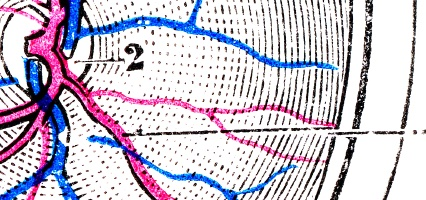
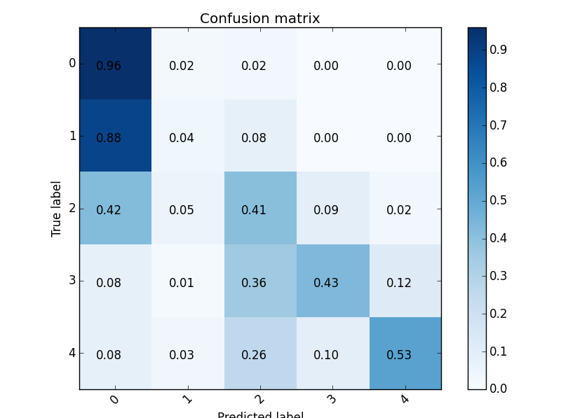

 
##   Diabetic Retinopathy Detection 24th place solution

Competition page: [Diabetic Retinopathy Detection](https://www.kaggle.com/c/diabetic-retinopathy-detection).

Please, look at the [slides](diabetic_retinopathy_detection.pdf) for high-level overview.

## Confusion matrix for one of the last submissions

